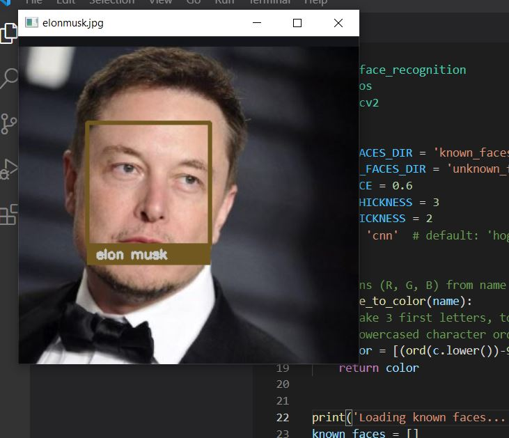

# python-face-recognition
In this warehouse, I told you how you can make a face recognition system.
# Resources
https://pythonprogramming.net/facial-recognition-python/
# Setup
```pip install cv2```<br>
```pip install face_recognition```<br>
# İmages
<br>
<br>
# Who Made This Code?
https://pythonprogramming.net<br>

